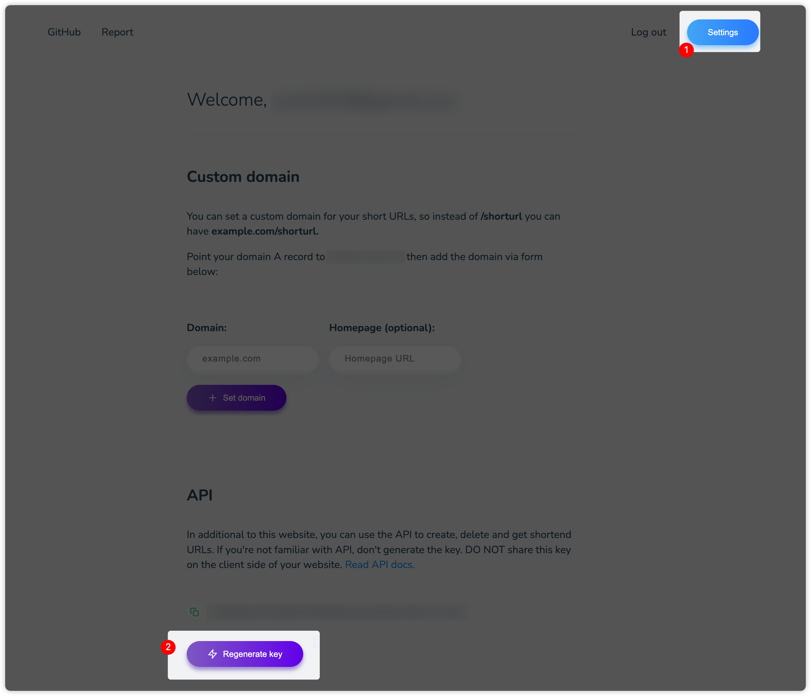
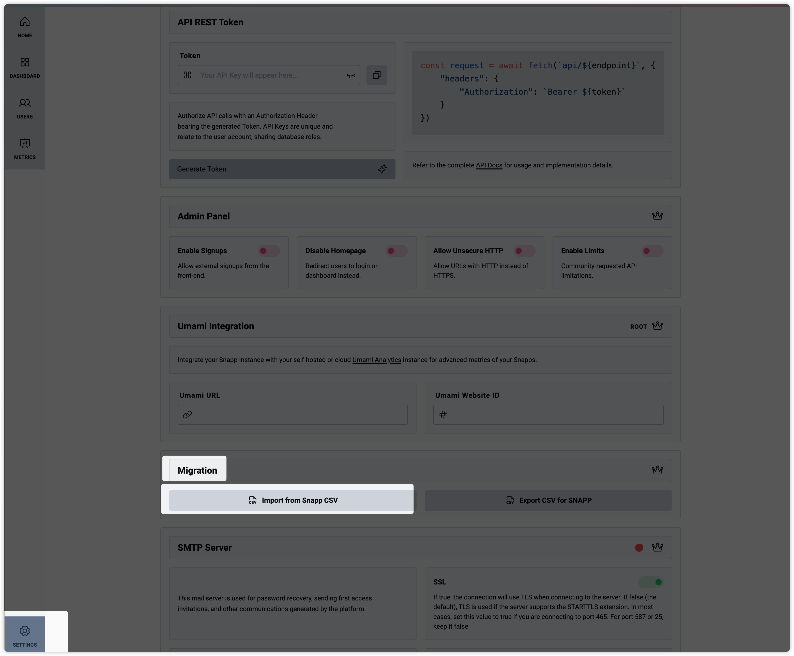

# kutt-to-snapp

Migrate short URLs from [kutt](https://kutt.it) to [snapp](https://snapp.li/).

## Usage

```shell
KUTT_URL=https://kutt.it \
KUTT_TOKEN=your-kutt-token \
MIGRATE_ALL=true \
npx kutt-to-snapp > kutt.csv
```

`kutt-to-snapp` will output the CSV file to stdout.

`KUTT_URL` and `KUTT_TOKEN` are required.

`KUTT_TOKEN` can generate in settings page.



`MIGRATE_ALL` is optional. default value is `false`. If set to `true`, it will read all short URLs from kutt. Only you are the administrator of kutt.

After exporting, you can import the CSV file to snapp.



The current script only implements single-user data migration.

If you are the administrator of a self-hosted kutt instance and you accept to migrate all data under a single snapp username, then this script can accomplish this by passing in the MIGRATE_ALL=true environment variable.

For multi-user migrations, there is currently no support.

## License

MIT.
